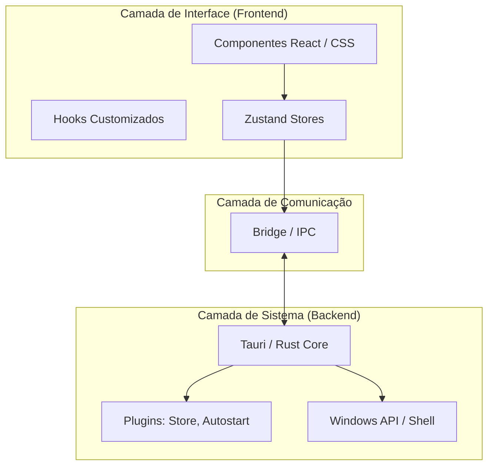
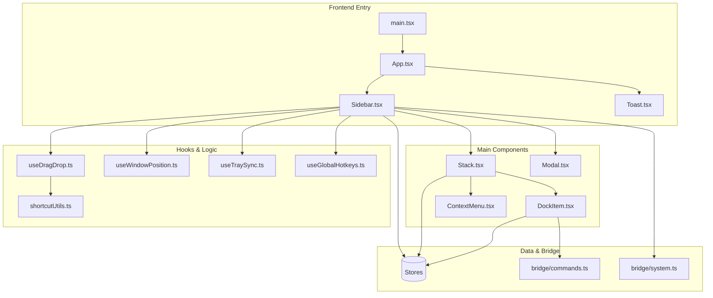

# SideDockNest — Arquitetura do Projeto

Documentação técnica da arquitetura do aplicativo **SideDockNest**, um organizador de atalhos em barra lateral construído com **Tauri + React**.

---

# 📑 Índice

1. [Diagrama de Camadas](#diagrama-de-camadas)  
2. [Modelo Mental do Sistema](#modelo-mental-do-sistema)  
3. [Fluxo de Inicialização](#fluxo-de-inicialização)  
4. [Treeview do Projeto](#treeview-do-projeto)  
5. [Mapa de Dependências](#mapa-de-dependências)  
6. [Descrição dos Arquivos Principais](#descrição-dos-arquivos-principais)  
7. [Matriz de Tarefas](#matriz-de-tarefas-cheat-sheet)  
8. [Camada de Comunicação](#camada-de-comunicação-bridge)  
9. [Registro de Comandos e Eventos](#registro-de-comandos-e-eventos-ipc)  
10. [Fluxo de Dados](#fluxo-de-dados)  
11. [Estrutura de Dados Principal](#estrutura-de-dados-principal)  
12. [Regras e Restrições de Arquitetura](#regras-e-restrições-de-arquitetura)  
13. [Como Usar Este Documento](#como-usar-este-documento)

---

# Diagrama de Camadas



[⬆ Voltar ao índice](#índice)

---

# Modelo Mental do Sistema

Esta seção descreve os conceitos fundamentais para entender o funcionamento do **SideDockNest**.

## Dock (Sidebar)

Contêiner principal que vive na borda da tela.

Responsável por:

- controlar expansão e colapso
- hospedar stacks e atalhos
- manter a interface visível ou oculta

**Arquivo:**  
`src/components/dock/Sidebar.tsx`

Fluxo:

```
Hover / Hotkey
↓
Hook de Posicionamento
↓
Redimensionamento da Janela Nativa
↓
UI Expandida
```

---

## DockItem

Representa um atalho individual para arquivo, executável ou URL.

**Arquivo:**  
`src/components/dock/DockItem.tsx`

Fluxo:

```
Clique no Item
↓
Bridge Command (open_file)
↓
Rust Backend
↓
Windows Shell API (ShellExecute)
```

---

## Stack

Agrupamento lógico de itens (tipo pasta).

**Arquivo:**  
`src/components/dock/Stack.tsx`

Fluxo:

```
Toggle Expand
↓
Zustand Update
↓
Re-render dos itens
↓
Redimensionamento automático do Dock
```

---

## DockStore

Cérebro que mantém a lista de atalhos e stacks.

**Arquivo:**  
`src/stores/dockStore.ts`

Fluxo:

```
Drag & Drop
↓
Mutation no Zustand
↓
Sincronização com Tauri Store
```

---

## ConfigStore

Gerencia comportamento global do app.

**Arquivo:**  
`src/stores/configStore.ts`

Fluxo:

```
Toggle Side
↓
State Update
↓
Bridge Command
↓
Rust Window Update
```

---

## Bridge

Fronteira entre React e Rust.

**Local:**  
`src/bridge/`

Fluxo:

```
Função TS
↓
Tauri IPC Invoke
↓
Registro em lib.rs
↓
Execução em commands.rs
```

---

## Backend Rust

Executa operações privilegiadas.

Local:

```
src-tauri/src/
```

Responsabilidades:

- manipular janelas
- extrair ícones
- acessar APIs do Windows

---

## Sistema de Ícones

Sistema de cache que converte executáveis em PNG.

Fluxo:

```
Executável
↓
extract_icon
↓
PNG cache
↓
icon:// protocol
↓
Renderização React
```

---

## Persistência

Responsável por manter dados entre sessões.

Ferramenta:

```
tauri-plugin-store
```

Fluxo:

```
Mudança no Zustand
↓
Hook de persistência
↓
JSON salvo no disco
```

[⬆ Voltar ao índice](#índice)

---

# Fluxo de Inicialização

## Backend (Rust)

1. Inicia processo nativo
2. Registra plugins (`tauri-plugin-store`)
3. Registra protocolo `icon://`
4. Lê `config.json`
5. Posiciona janela
6. Cria ícone na bandeja

---

## Frontend (React)

1. `App.tsx` monta a interface
2. Executa `loadConfig()`
3. Executa `loadDock()`
4. Zustand sincroniza estado
5. Tema é aplicado

[⬆ Voltar ao índice](#índice)

---

# Treeview do Projeto

```text
sidedocknest/
├── src/                    # Frontend (React + TypeScript)
│   ├── bridge/             # Camada de comunicação (IPC) com o Rust
│   │   ├── commands.ts
│   │   └── system.ts
│   ├── components/         # Componentes de interface
│   │   ├── common/         # Componentes genéricos
│   │   │   ├── ContextMenu.tsx
│   │   │   ├── Modal.tsx
│   │   │   └── Toast.tsx
│   │   └── dock/           # Componentes principais do Dock
│   │       ├── DockItem.tsx
│   │       ├── Sidebar.tsx
│   │       └── Stack.tsx
│   ├── hooks/              # Hooks customizados
│   │   ├── useDragDrop.ts
│   │   ├── useGlobalHotkeys.ts
│   │   ├── useTraySync.ts
│   │   └── useWindowPosition.ts
│   ├── stores/             # Gerenciamento de estado (Zustand)
│   │   ├── configStore.ts
│   │   ├── dockStore.ts
│   │   └── toastStore.ts
│   ├── styles/             # Estilização global (CSS)
│   ├── types/              # Definições de tipos TypeScript
│   │   └── dock.ts
│   ├── utils/              # Funções utilitárias
│   │   └── shortcutUtils.ts
│   ├── App.tsx             # Componente raiz do React
│   └── main.tsx            # Ponto de entrada do Frontend
├── src-tauri/              # Backend (Rust + Tauri)
│   ├── src/                # Código fonte Rust
│   │   ├── commands.rs
│   │   ├── lib.rs
│   │   ├── main.rs
│   │   └── tray.rs
│   └── tauri.conf.json     # Configuração principal do Tauri
├── public/                 # Ativos estáticos públicos
└── package.json            # Dependências e scripts do projeto
```

[⬆ Voltar ao índice](#índice)

---

# Mapa de Dependências



[⬆ Voltar ao índice](#índice)

---

# Descrição dos Arquivos Principais

## Frontend

| Arquivo | Função |
|------|------|
| `commands.ts` | Chamadas invoke para Rust |
| `system.ts` | Listeners de eventos |
| `Sidebar.tsx` | Dock principal |
| `DockItem.tsx` | Item individual |
| `Stack.tsx` | Agrupamento |
| `ContextMenu.tsx` | Menu contextual |
| `Modal.tsx` | Diálogos |
| `Toast.tsx` | Notificações |

---

## Backend

| Arquivo | Função |
|------|------|
| `commands.rs` | comandos IPC |
| `lib.rs` | inicialização |
| `tray.rs` | menu da bandeja |
| `main.rs` | entrypoint |

---

## Raiz

| Arquivo | Função |
|------|------|
| `vite.config.ts` | build frontend |
| `tsconfig.json` | config TS |
| `package.json` | dependências |

[⬆ Voltar ao índice](#índice)

---

# Matriz de Tarefas (Cheat Sheet)

| Tarefa | Arquivo | Apoio |
|------|------|------|
| Menu da bandeja | tray.rs | system.ts |
| Visual do dock | CSS | Sidebar |
| Ação nativa | commands.rs | commands.ts |
| Persistência | dockStore | lib.rs |
| Hotkeys | useGlobalHotkeys | system.ts |
| Posicionamento | commands.rs | useWindowPosition |

[⬆ Voltar ao índice](#índice)

---

# Camada de Comunicação (Bridge)

Comunicação entre **React** e **Rust** via IPC.

### Frontend → Backend

Arquivo:

```
bridge/commands.ts
```

Usa `invoke()`.

Exemplos:

- abrir arquivos
- extrair ícones
- verificar paths

---

### Backend → Frontend

Arquivo:

```
bridge/system.ts
```

Eventos emitidos pelo sistema.

Exemplos:

- trocar tema
- expandir dock
- alternar lado

[⬆ Voltar ao índice](#índice)

---

# Registro de Comandos e Eventos (IPC)

## Commands

```
open_file
open_file_location
extract_icon
resolve_shortcut
update_window_bounds
path_exists
list_start_menu_items
```

---

## Events

```
tray-toggle-side
tray-toggle-theme
tray-toggle-autostart
tray-toggle-expand
tauri://drag-drop
```

[⬆ Voltar ao índice](#índice)

---

# Fluxo de Dados

Persistência:

```
Zustand
↓
Tauri Store
↓
JSON
```

Clique em item:

```
UI
↓
Bridge
↓
Rust
↓
Windows API
```

[⬆ Voltar ao índice](#índice)

---

# Estrutura de Dados Principal

```typescript
interface DockItem {
  id: string
  name: string
  path: string
  icon: string
  type: 'file' | 'folder' | 'url'
  groupId?: string
}

interface AppConfig {
  theme: 'light' | 'dark' | 'system'
  side: 'left' | 'right'
  autoStart: boolean
  isExpanded: boolean
  opacity: number
}
```

[⬆ Voltar ao índice](#índice)

---

# Regras e Restrições de Arquitetura

1️⃣ Nunca usar caminhos diretos para ícones.

Sempre:

```
icon://hash.png
```

---

2️⃣ Frontend **não acessa sistema de arquivos**

Sempre usar:

```
bridge → Rust
```

---

3️⃣ Posicionamento da janela

Nunca via CSS.

Sempre via:

```
Rust window API
```

---

4️⃣ Estado persistido

Fonte de verdade:

```
tauri-plugin-store
```

[⬆ Voltar ao índice](#índice)

---

# Como Usar Este Documento

Fluxo recomendado de leitura:

1️⃣ Modelo Mental  
2️⃣ Camadas  
3️⃣ Inicialização  
4️⃣ Dependências  
5️⃣ Arquivos principais  

Este documento serve para:

- onboarding de devs
- entendimento rápido da arquitetura
- análise por IA
- manutenção do projeto
